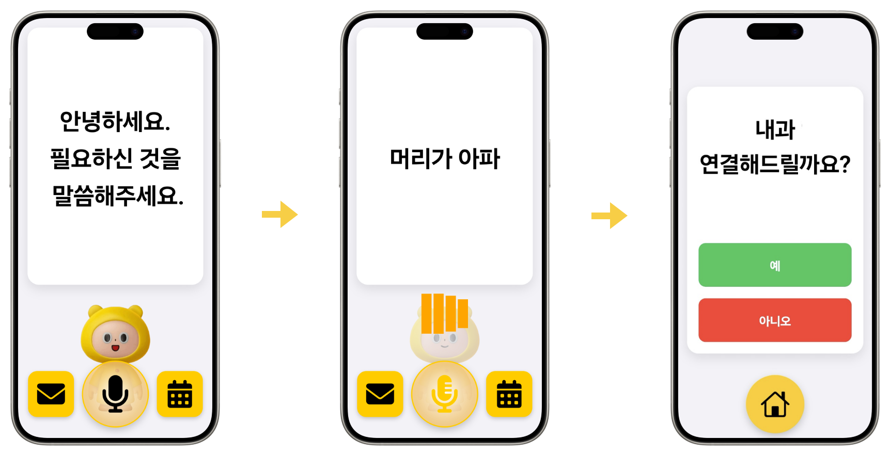
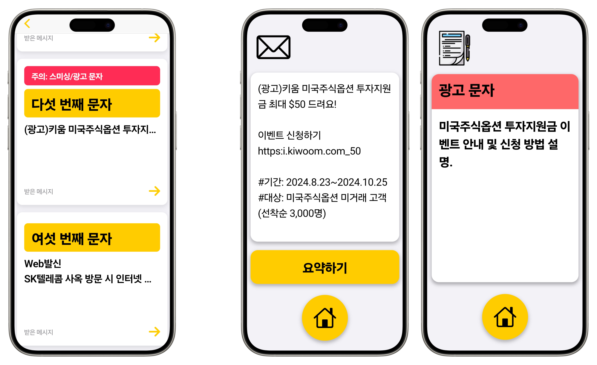
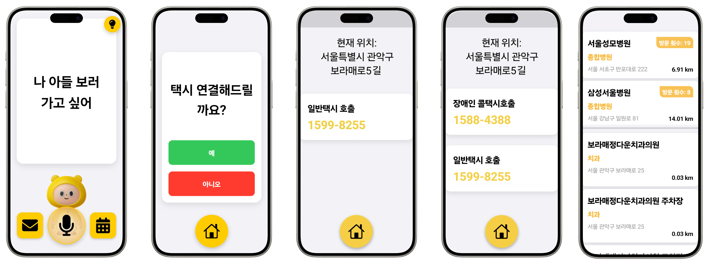
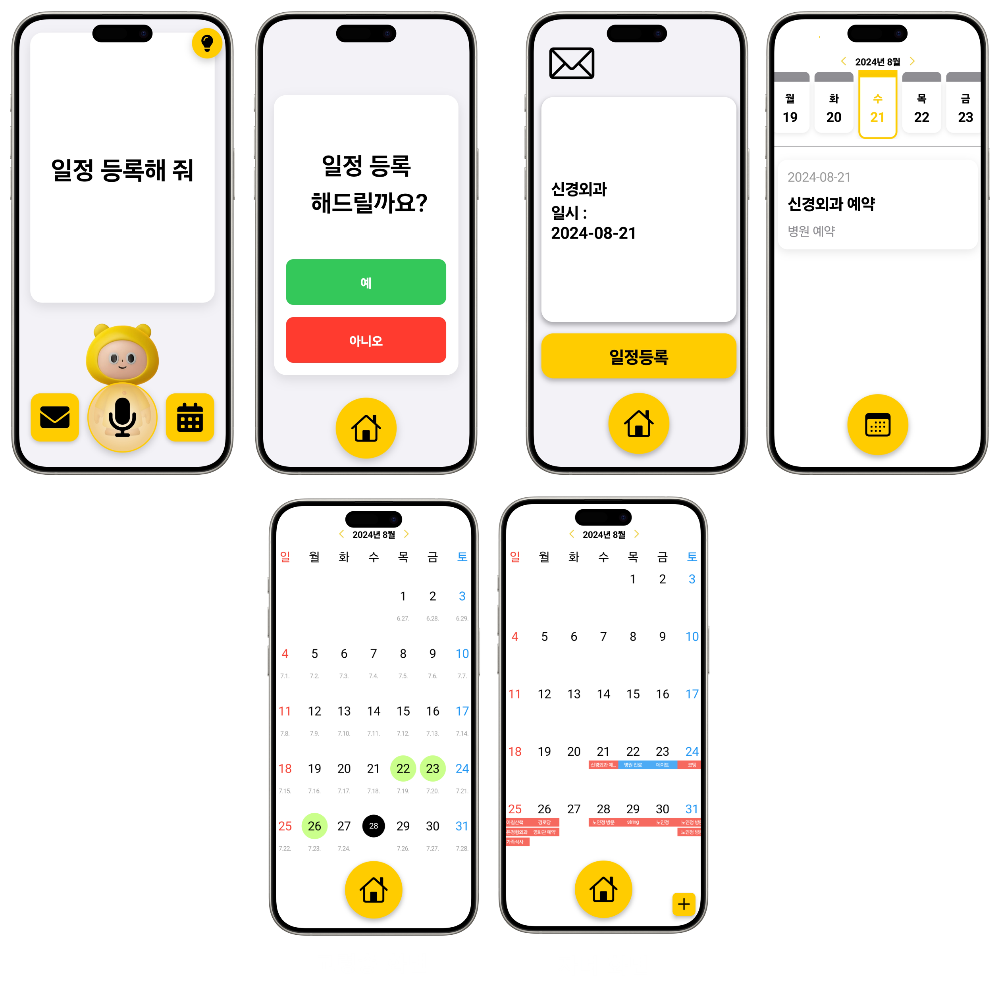
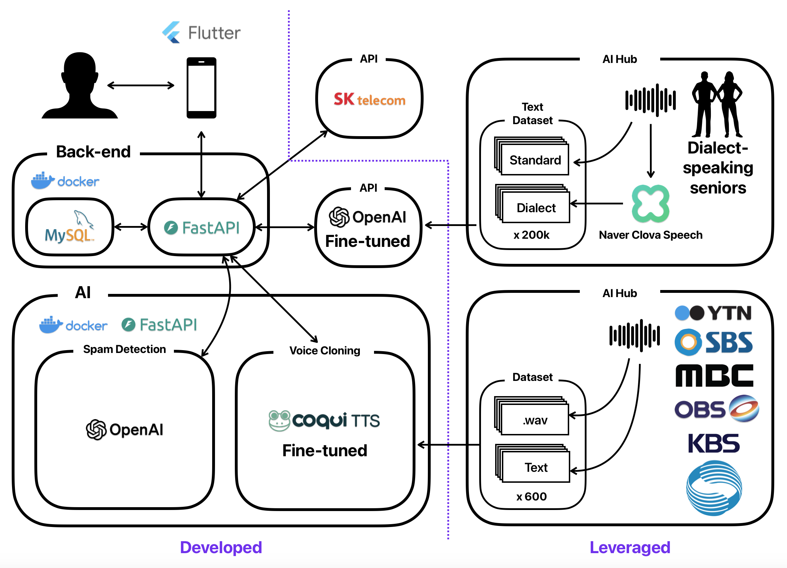
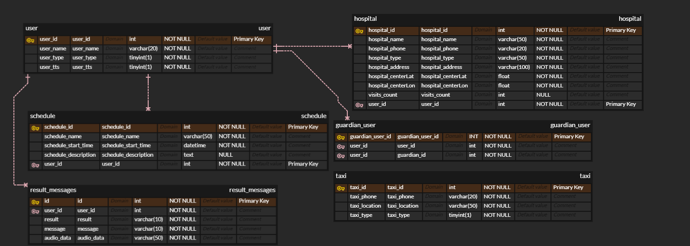

# A.Dot Silver

**May A.Dot Silver always be a grandchild to the elderly, helping not only with smartphone use but also enriching their life experiences.**

## Project Description
**A.Dot Silver** is a customized voice-recognition-based smartphone application developed to help elderly users use their smartphones more easily and efficiently. The goal of this project is to enable elderly users to smoothly utilize everyday smartphone functions solely through voice commands, without the need for touch-based complex interfaces.

## Objectives
- **Provide a User-Friendly Smartphone Experience**: Improve the user interface (UI) and user experience (UX) so that elderly users can use their smartphones more easily and intuitively.
- **Enhance Voice Recognition Capabilities**: Optimize voice recognition technology to accurately understand elderly users' speech and provide appropriate services accordingly.
- **Offer Customized Services**: Provide key features such as text analysis, personalized information search, and schedule management tailored to the needs of elderly users.

## Features
- **Voice-Based Navigation**: Supports the use of various smartphone functions through voice commands instead of touch.
- **Custom LLM Model**: An advanced model trained on approximately 200,000 text data to understand inaccurate speech and dialects of elderly users.
- **Smart Text Analysis**: Summarizes long text messages and filters spam to help elderly users easily understand the information.
- **Personalized Information Search**: Provides location-based services like taxi calls and hospital searches, offering information tailored to user patterns.
- **Automated Schedule Management**: Automatically reflects schedule information obtained through texts or calls into the calendar for convenient schedule management.
- **Elder-Friendly UI/UX**: An interface optimized for elderly users, with adjustments in font size, color, etc., for easier use.
- **Family Voice-Based TTS**: Provides voice guidance using familiar family voices, increasing the user's psychological comfort.

## Team Introduction
- **Team Name**: 비범대 (飛範大)
- **Team Members**: Sim Hyun-woo, Kim Sung-hyun, Song Ju-young, Lee Hyo-min, Han Sung-wook
- **Mentor**: Lee Joong-yoon (SKT)

# Roles in the Project
| Name        | Role        |  
|------------|------------|
| **김성현** | AI         |  
| **송주영** | AI         |  
| **심현우** | Frontend (FE) |  
| **이효민** | Frontend (FE) |  
| **한성욱** | Backend (BE)  |

### Tech Stack

### Frontend (FE)

### UX·UI

### Backend (BE)

### Infrastructure (Infra)

### Co-Work

# Screen Layout
***Intention Extraction***

***Text Analysis***

***Personalized Information Search***

***Automated Schedule Processing***

# System Architecture

# ERD

